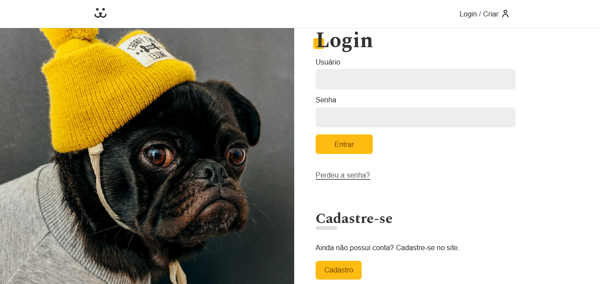

# Rede social Dogs

<p style="font-size: 16px;">Dogs é uma rede social para cachorros desenvolvido com React-JS.</p>
<hr>

## Técnologias Utilizadas

- React-JS
- React Router Dom
- Victory
<hr>

## Visual do Animais Fantásticos



## Visualize todo o projeto em

<a href="https://dogs-canezinbeto.vercel.app/" target="_blank">https://dogs-canezinbeto.vercel.app/</a>

<hr>

## Para testar na sua máquina

```bash
# Basta clonar o repositório em sua máquina
$ git clone https://github.com/CanezinBeto/dogs.git

# Instalar as dependências
npm install

# Execute a aplicação
npm start
```

Desenvolvido por Alberto Canezin :rocket: [veja meu LinkeIn](https://www.linkedin.com/in/albertocanezin-dev/)
